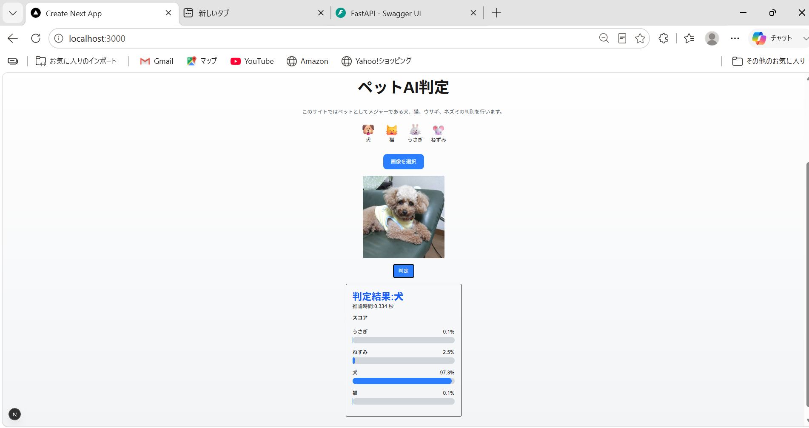
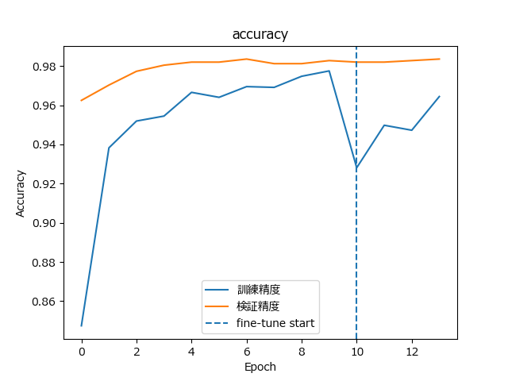
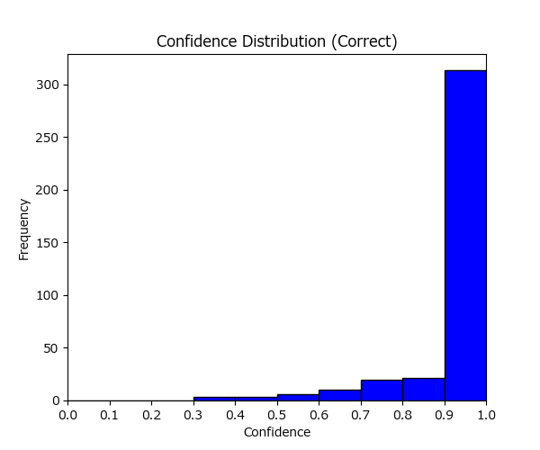
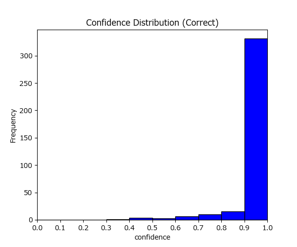
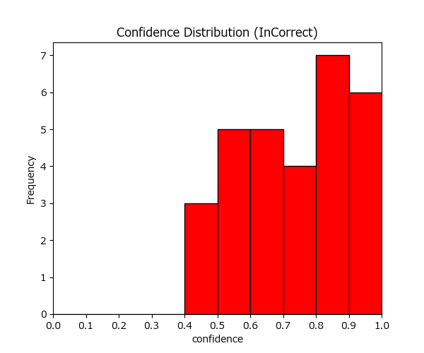
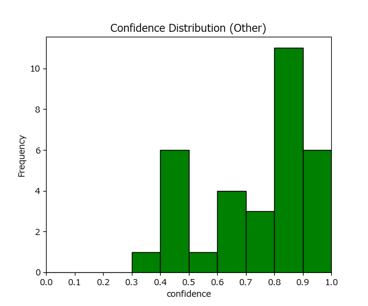
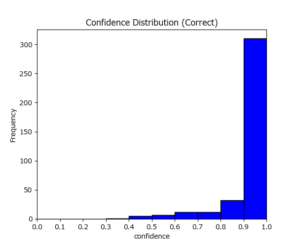
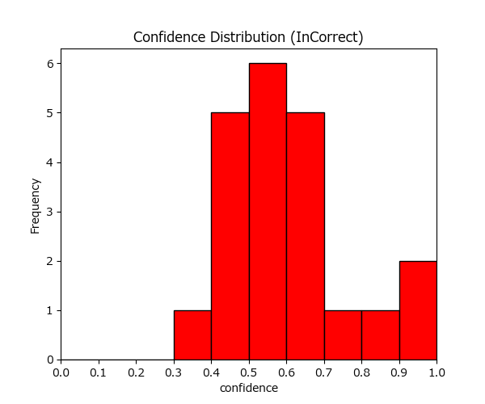
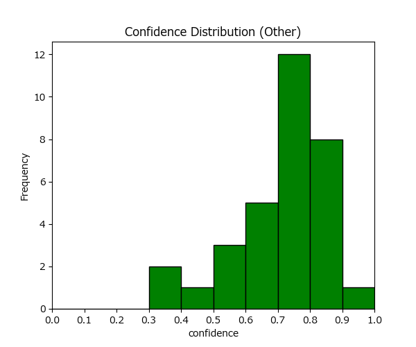

# ペットAI判定アプリ

## 概要

ペット画像をAIで分類するWebアプリです。  
犬・猫・うさぎ・ねずみの4種類を判定できます。

ユーザーが画像をアップロードすると、  
TensorFlowで学習した画像分類モデルが推論を行い、  
分類結果と各クラスのスコアを表示します。

また、分類スコアが一定値を下回る場合は  
「判別不可」として扱うことで、誤判定を減らす工夫を行っています。

---

## 制作背景

画像分類AIを学習する中で、
単にモデルを作成するだけでなく、
実際にユーザーが利用できる
Webアプリとして実装したいと考え制作しました。

本制作では、

- AIモデル作成
- FastAPIによるAPI化
- Reactとの連携
- UI/UX改善

まで一通り行い、
機械学習モデルを
「実際に利用できるシステム」として
構築することを意識しました。

## アプリ画面

### トップ画面

画像アップロード前の画面です。  
対応している動物の種類や、
シンプルで使いやすいUIを意識して設計しました。


### 判定結果画面

画像アップロード後、
AIによる分類結果と各クラスのスコアを表示します。  
判定結果を直感的に確認できるよう、
スコアバー形式で可視化しています。



---

## 主な機能

- 画像アップロード機能
- AIによる画像分類
- 推論スコア表示
- スコアバー表示
- 画像プレビュー表示
- confidence thresholdによる「判別不可」制御
- FastAPIとNext.jsのAPI連携

---

## 使用技術

### Frontend

- Next.js
- React
- TypeScript
- Tailwind CSS

### Backend

- FastAPI
- Python

### AI / Machine Learning

- TensorFlow
- Keras
- EfficientNetB0
- Transfer Learning

---

## システム構成

```txt
[ Next.js Frontend ]
        │
        │ 画像アップロード
        ↓
[ FastAPI Backend ]
        │
        │ 前処理
        │ ・リサイズ
        │ ・中央クロップ
        │ ・正規化
        ↓
[ TensorFlow Model ]
        │
        │ 推論結果
        ↓
[ JSON Response ]
        │
        ↓
[ Frontend ]
・判定結果表示
・スコアバー表示
```

## 学習データ

  合計6400枚

  クラス名：データ枚数
- うさぎ　：1600枚
- ネズミ　：1600枚
- 犬　　　：1600枚
- 猫　　　：1600枚

## テストデータ

### 評価用データ

  合計400枚

  クラス名：データ枚数
- うさぎ　：100枚
- ネズミ　：100枚
- 犬　　　：100枚
- 猫　　　：100枚

### その他データ

  合計366枚

  クラス名：データ枚数
- カラス　：72枚
- トカゲ　：21枚
- 亀　　　：22枚
- 魚　　　：21枚
- 熊　　　：95枚
- 象　　　：85枚
- 鳥　　　：20枚
- 馬　　　：30枚

## モデル性能

### 使用モデル

- EfficientNetB0

### 訓練精度と検証精度


### テスト精度

  全体精度：94%

  クラス名：正答率
- うさぎ　：91%
- ネズミ　：98%
- 犬　　　：92%
- 猫　　　：95%

学習時間：37分08.94秒

### confidence分布

<table>
<tr>
<td align="center"><b>正解データ</b></td>
<td align="center"><b>誤分類データ</b></td>
<td align="center"><b>その他データ</b></td>
</tr>

<tr>
<td></td>
<td></td>
<td></td>
</tr>
</table>

### モデルの選定理由

当初は犬・猫の2クラス分類を対象としており、
MobileNetV2を用いて学習を行っていました。

その後、対象を4クラスへ拡張したことで
精度が大きく低下しました。

そこでモデルの再選定を行うため、
複数のCNNモデルで比較実験を実施しました。

精度だけでなく、
誤分類時のconfidence分布も比較しました。
EfficientNet系統は高確信度での誤判定が少なく、
推論の信頼性が高い傾向が見られました。

その結果、下記の特徴を持つ
EfficientNetB0を採用しました。
- 精度が高い
- クラス間の性能差が小さい
- 高確信度誤判定が少ない
- B1との差が小さい
- 学習時間はB1より大幅に短い

|      モデル      | 精度 | 学習時間 |
|------------------|-----|----------|
|   MobileNetV2    | 39% |   30分   |
| MobileNetV3Small | 82% |   16分   |
| MobileNetV3Large | 94% |   24分   |
|  EfficientNetB0  | 94% |   37分   |
|  EfficientNetB1  | 95% |   58分   |

### 比較モデルの性能

#### MobileNetV2

  全体精度：39%

  クラス名：正答率
- うさぎ　：44%
- ネズミ　：77%
- 犬　　　：20%
- 猫　　　：14%

学習時間：30分42.45秒

#### MobileNetV3Small

  全体精度：82%

  クラス名：正答率
- うさぎ　：74%
- ネズミ　：99%
- 犬　　　：87%
- 猫　　　：77%

学習時間：16分52.88秒

#### MobileNetV3Large

  全体精度：94%

  クラス名：正答率
- うさぎ　：91%
- ネズミ　：99%
- 犬　　　：89%
- 猫　　　：96%

学習時間：24分13.72秒

<table>
<tr>
<td align="center"><b>正解データ</b></td>
<td align="center"><b>誤分類データ</b></td>
<td align="center"><b>その他データ</b></td>
</tr>

<tr>
<td></td>
<td></td>
<td></td>
</tr>
</table>

#### EfficientNetB1

  全体精度：95%

  クラス名：正答率
- うさぎ　：90%
- ネズミ　：100%
- 犬　　　：94%
- 猫　　　：95%

学習時間：58分40.37秒

<table>
<tr>
<td align="center"><b>正解データ</b></td>
<td align="center"><b>誤分類データ</b></td>
<td align="center"><b>その他データ</b></td>
</tr>

<tr>
<td></td>
<td></td>
<td></td>
</tr>
</table>

## 工夫した点

### confidence threshold による誤判定抑制

分類スコアが一定値を下回る場合は
「判別不可」とすることで、
無理に分類を行わないようにしました。

また、正解画像・誤分類画像・
学習対象外画像（その他画像）の
confidence分布を可視化し、
threshold値を検討しました。

ヒストグラムを確認した結果、
正解データは0.9〜1.0付近に集中しており、
低confidence帯では誤分類が増加する傾向が見られました。

そのため、誤判定を抑制する目的で
threshold=0.9を採用しました。

### UI/UX改善

分類結果を視覚的に分かりやすくするため、
スコアをバー形式で表示しました。

また、画像プレビュー機能を追加し、
ユーザーがアップロード画像を
事前確認できるようにしています。

## 環境構築

```bash
pip install -r requirements.txt
```

## 学習済みモデル

学習済みモデル(pet_model.keras)を同梱しているので
学習を行わずに推論APIを起動できます。

再学習を行う場合は

python backend/train.py

を実行してください。

## 起動方法

### Backend

```bash
cd backend
uvicorn api:app --reload
```

### Frontend

```bash
cd frontend
npm install
npm run dev
```

## 学んだこと

本制作を通して、

- AIモデル作成
- confidence分析による推論制御
- FastAPIによるAPI構築
- Next.jsとの連携
- フロントエンドUI改善


まで一通り経験することができました。

単にモデルを作成するだけでなく、
「ユーザーが利用できる形まで実装する重要性」を学びました。

## 今後の改善点

- 対応動物クラス数の追加
- Dockerによる環境構築
- AWS / Vercel へのデプロイ
- レスポンシブ対応強化