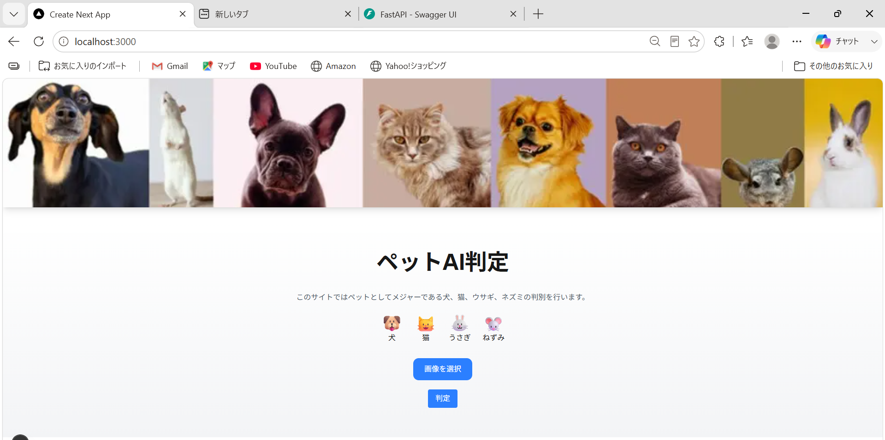
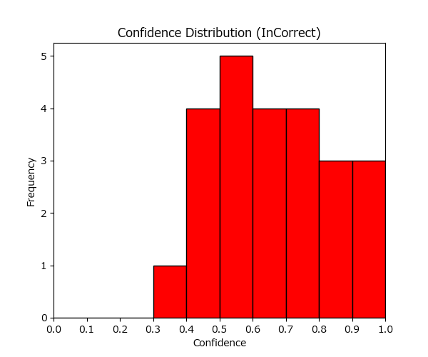
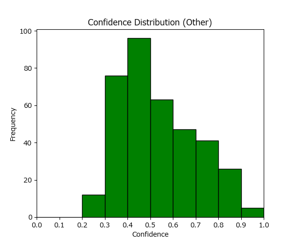

# ペットAI判定アプリ

## 概要

ペット画像をAIで分類するWebアプリです。  
犬・猫・うさぎ・ねずみの4種類を判定できます。

ユーザーが画像をアップロードすると、  
TensorFlowで学習した画像分類モデルが推論を行い、  
分類結果と各クラスのスコアを表示します。

また、分類スコアが一定値を下回る場合は  
「判別不可」として扱うことで、誤判定を減らす工夫を行っています。

---

## 制作背景

画像分類AIを学習する中で、
単にモデルを作成するだけでなく、
実際にユーザーが利用できる
Webアプリとして実装したいと考え制作しました。

本制作では、

- AIモデル作成
- FastAPIによるAPI化
- Reactとの連携
- UI/UX改善

まで一通り行い、
機械学習モデルを
「実際に利用できるシステム」として
構築することを意識しました。

## アプリ画面

### トップ画面

画像アップロード前の画面です。  
対応している動物の種類や、
シンプルで使いやすいUIを意識して設計しました。



### 判定結果画面

画像アップロード後、
AIによる分類結果と各クラスのスコアを表示します。  
判定結果を直感的に確認できるよう、
スコアバー形式で可視化しています。


---

## 主な機能

- 画像アップロード機能
- AIによる画像分類
- 推論スコア表示
- スコアバー表示
- 画像プレビュー表示
- confidence thresholdによる「判別不可」制御
- FastAPIとNext.jsのAPI連携

---

## 使用技術

### Frontend

- Next.js
- React
- TypeScript
- Tailwind CSS

### Backend

- FastAPI
- Python

### AI / Machine Learning

- TensorFlow
- Keras
- MobileNetV3Large
- Transfer Learning

---

## システム構成

```txt
[ Next.js Frontend ]
        │
        │ 画像アップロード
        ↓
[ FastAPI Backend ]
        │
        │ 前処理
        │ ・リサイズ
        │ ・中央クロップ
        │ ・正規化
        ↓
[ TensorFlow Model ]
        │
        │ 推論結果
        ↓
[ JSON Response ]
        │
        ↓
[ Frontend ]
・判定結果表示
・スコアバー表示
```

## 工夫した点

### confidence threshold による誤判定抑制

分類スコアが一定値を下回る場合は
「判別不可」とすることで、
無理に分類を行わないようにしました。

また、正解画像・誤分類画像・
学習対象外画像（その他画像）の
confidence分布を可視化し、
threshold値を検討しました。

#### confidence分布





ヒストグラムを確認した結果、
正解データは0.9〜1.0付近に集中しており、
低confidence帯では誤分類が増加する傾向が見られました。

そのため、誤判定を抑制する目的で
threshold=0.9を採用しました。

### UI/UX改善

分類結果を視覚的に分かりやすくするため、
スコアをバー形式で表示しました。

また、画像プレビュー機能を追加し、
ユーザーがアップロード画像を
事前確認できるようにしています。

## 今後の改善点

- 対応動物クラス数の追加
- Dockerによる環境構築
- AWS / Vercel へのデプロイ
- レスポンシブ対応強化

## 起動方法

### Backend

```bash
cd backend
uvicorn main:app --reload
```

### Frontend

```bash
cd frontend
npm run dev
```

## 学んだこと

本制作を通して、

- AIモデル作成
- confidence分析による推論制御
- FastAPIによるAPI構築
- Next.jsとの連携
- フロントエンドUI改善


まで一通り経験することができました。

単にモデルを作成するだけでなく、
「ユーザーが利用できる形まで実装する重要性」を学びました。